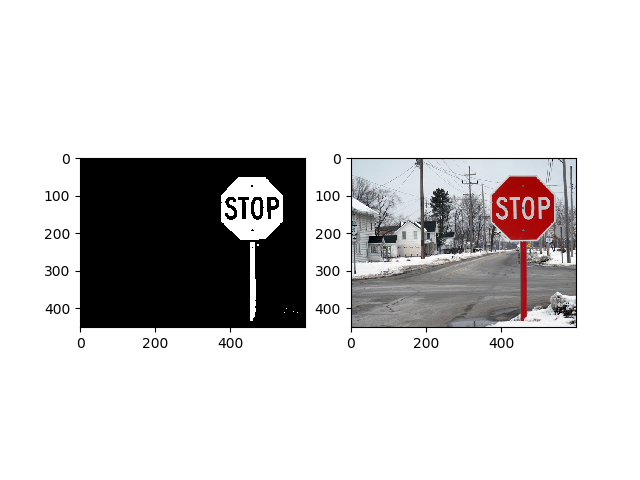
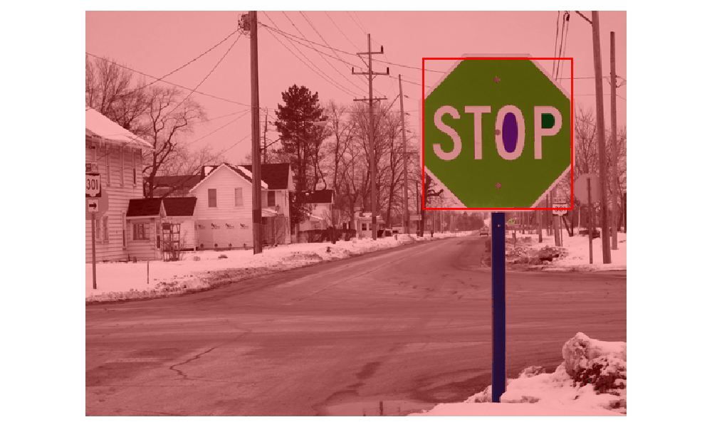
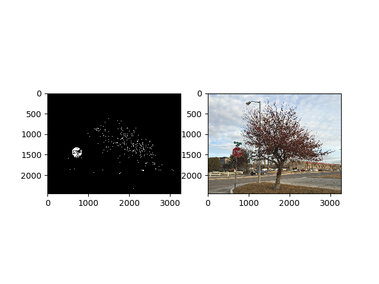
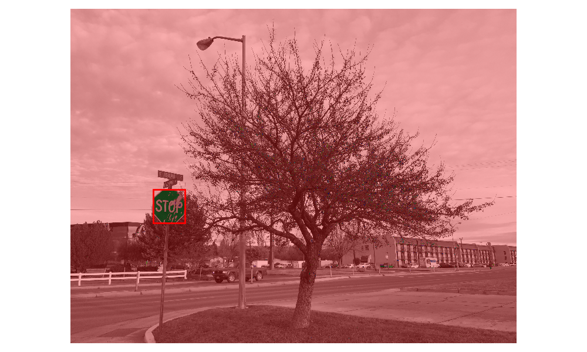

# Semantic Classifier

In this project pixel color classifier is modeled as a binary classification problem primarily to identify red color pixel in the images to detect objects of interest like stop sign. Then a bounding box is fitted around them to detect the stop signs from other regions of the image which might be red but not necessarily red.

Instructions to run:
1) Requirements - opencv-python>=3.4
                  matplotlib>=2.2
                  numpy>=1.14
                  scikit-image>=0.14.0
                  Roi Poly
                  
2) On the terminal use "python stop_sign_detector.py"

Problem Formulation:

The training data set consisted of around 200 images taken from variety of outdoor conditions with green, snowy, urban environment. All these images were segmented into red and non-red regions manually using RoI Poly toolbox and then the pixels were stored as .npy files. Trained a non-linear logistic regression model to classify colors into red and non-red. Below is an example of how the model performed on the train data. 

A loss of 0.001 was observed on train and validation had a loss of 0.12 after 100 epochs. Relatively good performance was seen on validation data set as well. 

For further details on formulation and implementation please refer the report in the repository.

